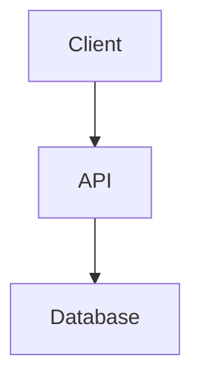

# Contributing to Dev Wiki

Thank you for contributing! This document outlines how to add, modify, and organize content.

---

##  Getting Started

1. **Fork** the repository
2. **Clone** your fork locally
3. Create a **branch** for your contribution
   ```bash
   git checkout -b add/my-new-guide
   ```

---

##  Content Guidelines

### File Naming

Use **kebab-case** with descriptive names:

```
clean-architecture.md
setup-docker-compose.md
ios-deployment-checklist.md
```

Pattern: `[action]-[topic].md` or `[topic]-[detail].md`

### Folder Placement

| Content Type       | Folder          |
| ------------------ | --------------- |
| Architecture docs  | `architecture/` |
| Setup guides       | `setup/`        |
| Backend code       | `backend/{lang}/` |
| Mobile guides      | `mobile/`       |
| Testing guides     | `testing/`      |
| CI/CD pipelines    | `cicd/`         |
| Infrastructure     | `infrastructure/` |

---

##  Guide Template

Copy [`TEMPLATE.md`](TEMPLATE.md) and fill in:

1. **Title**  Clear, descriptive
2. **Goal**   What problem does this solve?
3. **Prerequisites**  What do readers need first?
4. **Steps**  Numbered, actionable
5. **Code**  Use proper syntax highlighting
6. **Common Issues**  Gotchas and fixes
7. **References**  Links to official docs

---

##  Markdown Standards

### Code Blocks

Specify language for syntax highlighting:

````
```csharp
public class Example { }
```
````

### Diagrams

Use Mermaid (GitHub renders natively):

````

````

For complex diagrams, create in `assets/diagrams/` and reference:

```md

```

### Tags (Optional)

Add at the top of your file:

```md
Tags: #dotnet #docker #backend #beginner
```

---

##  PR Process

1. **Update README.md** if adding a major guide
2. **Link assets** properly (relative paths)
3. **Test** your steps work
4. **Submit PR** with clear title:
   ```
   docs: add Docker Compose guide for .NET APIs
   ```

### PR Title Prefixes

| Prefix | Use When                  |
| ------ | ------------------------- |
| `docs:`| Adding/modifying docs     |
| `fix:` | Correcting errors         |
| `refactor:`| Reorganizing content   |

---

##  Review Criteria

Your PR will be checked for:

*   Clear, concise writing
*   Working code examples
*   Proper folder placement
*   Following template structure
*   No broken links

---

##  Questions?

Open an issue or start a discussion. Contributions of all sizes welcome!
