# 📱 iOS Deployment Guide: Unity → App Store

Complete workflow for taking a Unity iOS game from development to App Store release.

---

##  Prerequisites

*   Apple Developer Account ($99/year)
*   Mac with Xcode (version matching Unity requirements)
*   Unity project with iOS build support installed
*   Test device (iPhone/iPad) for initial testing

---

##  Bundle ID Explained

**Bundle ID** = your app’s unique identifier in Apple’s ecosystem.

Format: `com.company.appname`

*   `com`  standard reverse domain notation
*   `company`  your studio/organization name
*   `appname`  specific app name

**Why explicit Bundle ID matters:**
*   Wildcard IDs (`com.company.*`) cannot use App Store or push notifications
*   Once published, Bundle ID **cannot be changed**
*   Must match exactly between Apple portal and Unity project

---

# 🚀 Phase 1: Apple Developer Portal Preparation

Before exporting from Unity, register your app in Apple’s ecosystem. This creates the "slot" for your app.

---

## 1.1 Register the App Identifier

The **App ID** links your app to capabilities (in-app purchases, push notifications, etc.).

**Steps:**

1. Go to https://developer.apple.com/account
2. Navigate to **Certificates, IDs & Profiles → Identifiers**
3. Click **+ (Add)** button (top-right)
4. Select **App IDs → Continue**
5. Select **App → Continue**
6. Fill in the form:

   | Field | What to Enter | Example |
   |-------|---------------|---------|
   | Description | Human-readable name | `500 Whistles Rush` |
   | Bundle ID | Select **Explicit** | - |
   | Bundle ID Value | Your unique ID | `com.mocciaart.500WhistlesRush` |

7. **Capabilities**  Enable what your app needs:
   *   Push Notifications  if sending alerts
   *   In-App Purchase  if selling items
   *   Game Center  if using leaderboards
   *   iCloud  if saving data to cloud

8. Click **Continue** then **Register**

**Why capabilities now?**
Each capability requires specific entitlements. Enabling here generates the provisioning profile that Xcode needs later.

---

## 1.2 Create App Store Connect Record

This creates your app’s **storefront**  where you’ll manage metadata, screenshots, and releases.

**Steps:**

1. Go to https://appstoreconnect.apple.com
2. Navigate to **Apps → + (top right) → New App**
3. Fill in:

   | Field | Description | Example |
   |-------|-------------|---------|
   | Platform | Choose iOS | iOS |
   | App Name | Public name shown on store | 500 Whistles Rush |
   | Primary Language | Store display language | English |
   | Bundle ID | Must match App ID from 1.1 | com.mocciaart.500WhistlesRush |
   | SKU | Unique product identifier | 500WR-001 |

4. Click **Create**

**SKU explained:**
*   Stock Keeping Unit  your internal tracking code
*   Must be unique across ALL your apps
*   Cannot be changed later
*   Common format: `APPNAME-VERSION` or `PRODUCT-ID`

---

# 🎮 Phase 2: Unity Build Process

Export your Unity project as an Xcode workspace.

---

## 2.1 Configure Player Settings

Open Unity: **Edit → Project Settings → Player**

### iOS Tab Settings

| Setting | Value | Notes |
|---------|-------|-------|
| Bundle Identifier | `com.company.appname` | **Must match** Apple portal exactly |
| Version | `1.0.0` | Public version (MAJOR.MINOR.PATCH) |
| Build Number | `1` | Internal build counter |

**Version vs Build Number:**
*   **Version**  What users see (1.0.0, 1.2.0, 2.0.0)
*   **Build Number**  Apple's tracking (1, 2, 3...)
*   Every App Store upload needs **new build number**
*   Version can stay same across builds (e.g., bug fixes)

### Other Important Settings

*   **Camera Usage Description**  Required if app uses camera
*   **Photo Library Usage**  Required if saving screenshots
*   **Architecture**  ARM64 (required for App Store)

---

## 2.2 Export the Project

**Steps:**

1. **File → Build Settings**
2. Select **iOS** from platform list
3. Click **Switch Platform** (if not already iOS)
4. Ensure your scene is in **Scenes In Build**
5. Click **Build** (or **Build And Run** for immediate device test)

**Where to save:**
Create an empty folder named clearly:

```
~/Builds/iOS/500WhistlesRush_v1.0.0_build1/
```

**What Unity generates:**

```
Unity-iPhone.xcodeproj/     Xcode project file
Unity-iPhone/               Source code
Libraries/                  Compiled frameworks
Classes/                    Native code
Data/                       Game assets
```

**Build time:** 2  10 minutes depending on project size.

---

# 📦 Phase 3: CocoaPods Integration

Unity iOS builds use **CocoaPods**  a dependency manager for iOS libraries.

---

## 3.1 Why CocoaPods?

Unity-generated Xcode projects often rely on third-party iOS SDKs:
*   Firebase (Analytics, Crashlytics)
*   Ad networks (Unity Ads, AdMob)
*   Social SDKs (Game Center, Facebook)

CocoaPods downloads and links these frameworks automatically.

---

## 3.2 Running Pod Install

**In terminal:**

```bash
cd ~/Builds/iOS/500WhistlesRush_v1.0.0_build1/
pod install
```

**What happens:**
1. CocoaPods reads `Podfile` (Unity creates this)
2. Downloads required frameworks from GitHub
3. Generates `.xcworkspace` file
4. Links dependencies to Xcode project

**Expected output:**

```
Analyzing dependencies
Downloading dependencies
Installing Firebase (10.x.x)
Generating Pods project
Integrating client project
```

---

## 3.3 CRITICAL: Use .xcworkspace

After `pod install` completes:

>  **NEVER open** `.xcodeproj`  
>  **ALWAYS open** `.xcworkspace`

**Why:**
The `.xcworkspace` file bundles:
*   Your Unity Xcode project
*   The Pods project (dependencies)

Opening `.xcodeproj` misses the Pods  your app will crash or fail to build.

**Correct file to open:**
```
Unity-iPhone.xcworkspace
```

---

# 🛠️ Phase 4: Xcode Archiving & Upload

Prepare and upload your app to Apple for distribution.

---

## 4.1 Open Project & Configure Signing

**Open:** `Unity-iPhone.xcworkspace`

### First-Time Setup

**Signing & Capabilities tab:**

1. Check **Automatically manage signing**
2. Select your **Team** (Apple Developer account)
3. Xcode will:
   *   Generate provisioning profile
   *   Register your device for testing
   *   Download necessary certificates

**What if signing fails?**

| Error | Cause | Fix |
|-------|-------|-----|
| "No profiles for 'com.X'" | Bundle ID mismatch | Verify Unity Bundle ID matches Apple portal |
| "Team not found" | No dev account added | Xcode → Preferences → Accounts → add Apple ID |
| "Certificate expired" | Old cert on machine | Keychain Access → delete old cert, let Xcode generate new |

---

## 4.2 Select Destination

Choose target device:

*   **Any iOS Device**  for Archive (release build)
*   **Your connected iPhone**  for quick testing

**For App Store upload:**
Always select **"Any iOS Device (arm64)"**  this creates an archiveable build.

---

## 4.3 Build Test (Optional but Recommended)

Before archiving, verify build works:

**Product → Run** (or  R)

App should install and launch on your device.

**Common build errors:**
*   **Minimum OS Version:** Set to iOS 12+ in Player Settings
*   **Metal support:** Ensure graphics API is Metal
*   **Missing frameworks:** Run `pod install` again

---

## 4.4 Archive the App

Archive creates a distributable package for Apple.

**Steps:**

1. Select **"Any iOS Device (arm64)"** as destination
2. **Product → Archive** (or  Shift +  B)

**What happens:**
*   Xcode builds for release configuration (optimized, no debug symbols)
*   Packages app into `.xcarchive` bundle
*   Opens Organizer window when complete

**Archive location:**
```
~/Library/Developer/Xcode/Archives/
```

**Time:** 5  20 minutes depending on project size.

---

## 4.5 Distribute to App Store

In Organizer window (opens automatically):

1. Select your archive (top item)
2. Click **Distribute App**
3. Choose distribution method:

   | Option | Use For |
   |--------|---------|
   | App Store Connect | TestFlight + App Store (recommended) |
   | Ad Hoc | Beta testing outside TestFlight |
   | Enterprise | Internal distribution (requires Enterprise account) |

4. Select **App Store Connect → Next**
5. **Upload:**
   *   Click **Upload**
   *   Xcode validates app
   *   Uploads to Apple (speed depends on connection)

**During upload:**
*   Do NOT quit Xcode
*   Stable internet required
*   Large apps can take 30+ minutes

**Success message:**
```
Upload succeeded
App Name: 500 Whistles Rush
Version: 1.0.0 (1)
```

---

# 🧪 Phase 5: TestFlight

TestFlight = Apple's beta testing platform. Every app goes through here before App Store.

---

## 5.1 Processing Wait

After Xcode upload finishes:

1. Go to https://appstoreconnect.apple.com
2. Navigate to **Apps → [Your App] → TestFlight**
3. Status will show **Processing** (10  30 minutes)

**What Apple does during processing:**
*   Scans for malware
*   Validates code signature
*   Checks for prohibited APIs
*   Generates testable build

---

## 5.2 Internal Testing

**Who can test:**
*   Up to 100 members of your Apple Developer team
*   No Apple review required
*   Instant access after processing

**How to invite:**
1. Go to **TestFlight → Internal Testing**
2. Click **+ Add** to add team members
3. Testers download TestFlight app (App Store)
4. Install your beta app

---

## 5.3 External Testing

**Who can test:**
*   Up to 10,000 external testers
*   **Apple review required** (takes 24  48 hours)

**Process:**
1. Go to **TestFlight → External Testing**
2. Add build
3. Submit information for review:
   *   What to test
   *   Marketing requirements (if any)
   *   Review notes

**Common rejection reasons:**
*   App crashes on launch
*   App is just a placeholder (no functionality)
*   Missing demo account (for login-based apps)

---

## 5.4 TestFlight Feedback Loop

Testers can:
*   Take screenshots
*   Report crashes
*   Leave written feedback

**Access feedback:**
App Store Connect → TestFlight → [Build] → Activity

---

# 🏪 Phase 6: App Store Publishing

When you're ready for public release.

---

## 6.1 App Store Information

Navigate to **App Store Connect → Apps → [Your App] → App Information**

### Required Metadata

| Field | Description | Tips |
|-------|-------------|------|
| App Name | Max 30 characters | Make it searchable |
| Subtitle | Max 30 characters | Explain what app does |
| Description | Plain text, no HTML | First 170 chars previewed |
| Keywords | Max 100 chars total | Comma-separated, SEO |
| Support URL | Website | Can be simple GitHub page |
| Marketing URL | Optional | Landing page if you have one |
| Privacy Policy | Required | Even simple page works |

**Keywords strategy:**
Think like a user searching:
```
whistles, rhythm, music game, casual, indie
```

---

## 6.2 Screenshots (Required)

Apple requires screenshots for EVERY device size:

| Device | Size | Quantity |
|--------|------|----------|
| iPhone 6.7" | 1290 × 2796 | 3  10 |
| iPhone 6.5" | 1242 × 2688 | 3  10 |
| iPhone 5.5" | 1242 × 2208 | 3  10 |

**Tips:**
*   Show gameplay, not menus
*   First 3 screenshots matter most (shown without scroll)
*   No device frames (Apple rejects these)
*   Must match game content

**Tools:**
*   Unity's Frame Recorder
*   macOS Screenshot tool (  Shift +  4)
*   Clean up: remove status bar, add device frame externally

---

## 6.3 App Review Information

**Required fields:**

| Field | Purpose |
|-------|---------|
| Demo Account | Username/password if app has login |
| Contact info | Your email for reviewer questions |

**Review notes:**
Explain anything unusual:
```
This is a rhythm game where players tap to beats.
We use Game Center for leaderboards.
No in-app purchases in this version.
```

---

## 6.4 Pricing & Availability

**Options:**

| Setting | Choices |
|---------|---------|
| Price | Free, or tiered pricing ($0.99  $999.99) |
| Availability | All countries, or specific regions |
| Content rights | "Worldwide rights" for most indie devs |

**Price tiers change:**
Can be changed anytime for future downloads (not existing purchases).

---

## 6.5 Submit for Review

**Final step:**

1. Go to **App Store → Prepare for Submission**
2. Fill all required sections (marked with  icon)
3. Click **Add for Review** (top button)
4. Confirm submission

**What happens next:**
*   **Status:** Waiting for Review → In Review → Approved/Rejected
*   **Timeline:** 24  72 hours (varies by region, holidays)

**Rejection?**
Read the resolution center carefully. Common fixes:
*   Crash on specific device
*   Missing metadata
*   Guideline violation (e.g., mentions other platforms)

---

# ✅ Phase 7: Release

Once approved:

1. Status changes to **Pending Release**
2. Choose release method:

   | Option | Description |
   |--------|-------------|
   | Manual Release | You control when it goes live (recommended) |
   | Automatic Release | Goes live once approved |

3. Click **Release** button when ready

**Your app is now live on the App Store!** 🎉

---

# 📌 Complete Flow Diagram

```mermaid
graph LR
A[Unity Project] --> B[Build Settings]
B --> C[Export to Xcode]
C --> D[pod install]
D --> E[Open .xcworkspace]
E --> F[Configure Signing]
F --> G[Archive]
G --> H[Upload to Apple]
H --> I[Processing Complete]
I --> J[TestFlight Testing]
J --> K[Submit for Review]
K --> L[Approved]
L --> M[App Store Live]
```



---

#  Troubleshooting Common Issues

| Issue | Solution |
|-------|----------|
| Invalid Bundle ID | Match Apple portal exactly |
| Pod install fails | `sudo gem install cocoapods`; `pod repo update` |
| Archive fails | Clean build folder ( Shift +  Cmd +  K); check destination |
| Upload stuck | Cancel and retry; check internet |
| TestFlight crashes | Test on device first; check device logs |
| Review rejected | Read Resolution Center; fix specific issue; resubmit |

---

#  References

*   [Apple App Review Guidelines](https://developer.apple.com/app-store/review/guidelines/)
*   [Unity iOS Documentation](https://docs.unity3d.com/Manual/ipados-deployment.html)
*   [App Store Connect Help](https://help.apple.com/app-store-connect/)
